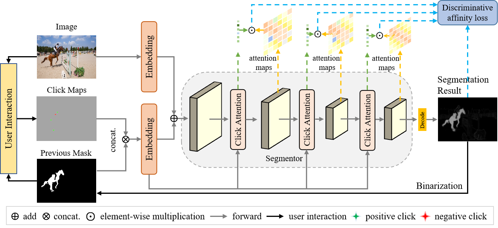
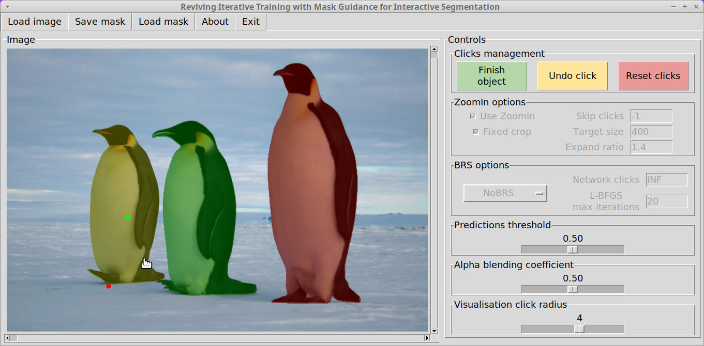
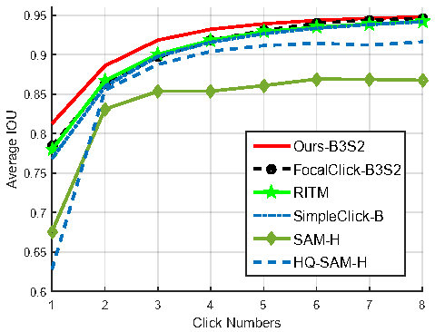

# ClickAttention: Click Region Similarity Guided Interactive Segmentation

## Updates

***30/July/2023***

Interactive online demo is released🚀🚀. [DEMO](http://img2latex.com)

***11/May/2023***

Code, datasets, and pretrained models are released🚀🚀.

## Introduction 
The pipeline of the proposed algorithm.
<p align="center">
  
</p>
Interactive segmentation algorithms based on click points have garnered significant attention from researchers in recent years.
However, existing studies typically use sparse click maps as model inputs to segment specific target objects, which primarily affect local regions and have limited abilities to focus on the whole target object, leading to increased times of clicks.
To address this issue, we propose a click attention algorithm that expands the influence range of positive clicks based on the similarity between positively-clicked regions and the whole input. 
We also propose a discriminative affinity loss to reduce the attention coupling between positive and negative click regions to avoid an accuracy decrease caused by mutual interference between positive and negative clicks.
Extensive experiments demonstrate that our approach is superior to existing methods and achieves cutting-edge performance. 
ClickAttention is codebase for click-based interactive segmentation developped on [RITM codebase](https://github.com/SamsungLabs/ritm_interactive_segmentation) and [FocalClick](https://github.com/alibaba/ClickSEG). 
<br/>

## Interactive Segmentation Demo

The process of interactive segmentation is shown in the following diagram:
<p align="center">
  
</p>

We use the graphical user interface (GUI) provided by [RITM codebase](https://github.com/SamsungLabs/ritm_interactive_segmentation) to deploy the interactive segmentation algorithm.
<p align="center">
  
</p>

The GUI is based on TkInter library and its Python bindings. You can try our interactive demo with any of the provided models. 
Our scripts automatically detect the architecture of the loaded model, just specify the path to the corresponding checkpoint.
<br/>

## Results

The proposed algorithm achieved competitive performance when compared to the current state-of-the-art (SOTA). 
| method                | GrabCut | Berkeley | SBD    |        | DAVIS  | COCO_MVal |        | PascalVOC |        |
|-------------------|---------|----------|--------|--------|--------|-----------|--------|-----------|--------|
|                   | NOC 90  | NOC 90   | NOC 85 | NOC 90 | NOC 90 | NOC 85    | NOC 90 | NOC 85    | NOC 90 |
| f-BRS-B-hrnet32   | 1.69    | 2.44     | 4.37   | 7.26   | 6.5    | -         | -      | -         | -      |
| RITM-hrnet18s     | 1.68    | 2.6      | 4.25   | 6.84   | 5.98   | -         | 3.58   | 2.57      | -      |
| RITM-hrnet32      | 1.56    | 2.1      | 3.59   | 5.71   | 5.34   | 2.18      | 3.03   | 2.21      | 2.59   |
| EdgeFlow-hrnet18  | 1.72    | 2.4      | -      | -      | 5.77   | -         | -      | -         | -      |
| SimpleClick-ViT-B | 1.5     | 1.86     | 3.38   | 5.5    | 5.18   | 2.18      | 2.92   | 2.06      | 2.38   |
| FocalClick-B0S2   | 1.9     | 2.92     | 5.14   | 7.8    | 6.47   | 3.23      | 4.37   | 3.55      | 4.24   |
| FocalClick-B3S2   | 1.68    | 1.71     | 3.73   | 5.92   | 5.59   | 2.45      | 3.33   | 2.53      | 2.97   |
| Ours-B0S2          | 1.66    | 2.65     | 4.45   | 6.9    | 5.44   | 2.81      | 3.77   | 2.87      | 3.36   |
| Ours-B3S2          | **1.46**    | 1.95     | **3.26**   | **5.23**   | **4.72**   | **2.17**      | **2.89**   | **2.05**      | **2.37**   |

<br/>
Average results on 8 different benchmarks. 
<p align="center">
  
</p>
<br/>

**TODO: Better results will be obtained after adopted `zoom_in` operation in evaluation, more results will be released soon...**

## What's New?
We added a more efficient DDP training strategy to train the network, with faster training speed.

## User Guidelines
To use this codebase to train/val your own models, please follow the steps:

1. Install the requirements by excuting
```
pip install -r requirements.txt
pip install easydict pyyaml albumentations tensorboard tqdm timm attr ray IPython
pip install opencv-python-headless==4.1.2.30  -i https://mirrors.ustc.edu.cn/pypi/web/simple
pip install --upgrade typing_extensions
pip install -U openmim  -i https://mirrors.ustc.edu.cn/pypi/web/simple
export LC_ALL=C.UTF-8
export LANG=C.UTF-8
mim install mmcv-full  -i https://mirrors.ustc.edu.cn/pypi/web/simple
sed -i 's@//.*archive.ubuntu.com@//mirrors.ustc.edu.cn@g' /etc/apt/sources.list
apt update
apt-key adv --keyserver keyserver.ubuntu.com --recv-keys A4B469963BF863CC
apt install ffmpeg libsm6 libxext6 -y
```

2. Prepare the dataset and pretrained backbone weights following: [Data_Weight_Preparation.md](assets/documents/Data_Weight_Preparation.md)

3. Train or validate the model following: [Train_Val_Guidance.md](assets/documents/Train_Val_Guidance.md)

## License

The code is released under the Apache License. It is a short, permissive software license. Basically, you can do whatever you want as long as you include the original copyright and license notice in any copy of the software/source. 

## Acknowledgement
The core framework of this codebase follows: https://github.com/saic-vul/ritm_interactive_segmentation and https://github.com/alibaba/ClickSEG


We thank those authors for their great works.

## Citation

TODO:
```

```

